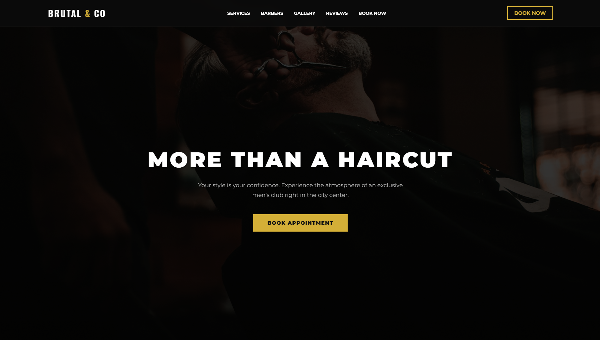

# BarberShop Landing Page

This is a landing page I created for a fictional premium barber shop.

The project was built to practice creating modern and responsive websites with a clean layout, smooth navigation and interactive elements.

## Live Demo

https://2cassstle.github.io/barbershop-landing/

## Features

* Responsive design
* Smooth scrolling navigation
* Booking form
* Services section
* Barber team section
* Gallery
* Customer reviews
* Google Maps integration
* Modern dark UI

## Technologies

* HTML
* CSS
* JavaScript

## About

This project is part of my web development portfolio. More projects will be added as I continue learning and improving my skills.
